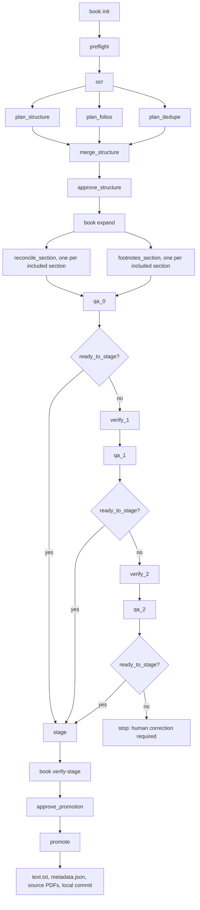

# Scanned-book agentic OCR workflow

This is the provider-neutral reproduction specification for the Nepali Archives
scanned-book workflow. It describes the execution contract, not a particular AI
vendor, product, model name, account, or payment arrangement.

The source page image is always authoritative. OCR output and agent output are
evidence used to make a faithful transcription; they are never authority to
modernize spelling, punctuation, wording, or structure.

## Contract versions

| Contract | Version |
|---|---|
| Persistent graph state | `graph_version: 1` |
| Agent task/result packet | `book-agent/v1` |
| Approved structure plan | `book-plan/v1` |
| Deterministic QA report | `book-qa/v1` |

The executable definitions live in:

- [`ocr/archive_ocr/book_workflow.py`](../ocr/archive_ocr/book_workflow.py) — persistent graph and approval gates
- [`ocr/archive_ocr/book_graph.py`](../ocr/archive_ocr/book_graph.py) — approved-plan expansion and bounded QA branches
- [`ocr/archive_ocr/book_prompts.py`](../ocr/archive_ocr/book_prompts.py) — typed agent task/result contracts
- [`ocr/archive_ocr/book_cli.py`](../ocr/archive_ocr/book_cli.py) — command-line interface

## Executor requirements

An implementation needs:

1. This repository and its `ocr/` Python environment.
2. A local PDF renderer and Nepali OCR installation accepted by `book ocr`.
3. An agent executor that can run a self-contained task packet in an isolated
   context and write the typed result only to the packet's `result_path`.
4. An approver able to inspect and hash-bind the two gate artifacts.

Parallel execution is optional. A system without parallel agents can run ready
packets sequentially in fresh contexts; the semantic task boundaries and
independent checks must stay the same.

The logical capabilities are:

- `strong_reader`: difficult visual reading, structure analysis, full-section
  reconciliation, and targeted verification.
- `fast_reader`: bounded folio, catalogue/deduplication, and footnote sweeps.

Concrete runtime bindings are deliberately outside this specification.

## Exact execution graph



`book init`, `book expand`, and `book verify-stage` are graph-driving commands,
not persisted task nodes. All other rectangular identifiers in the diagram are
persisted nodes; the decision diamonds are transitions derived from a typed QA
report.

## Node and artifact contract

| Node or command | Requirement | Principal result |
|---|---|---|
| `book init` | Fingerprint the source and create resumable state | Persistent run graph |
| `preflight` | Check source shape, checksum, author, and archive conflicts | Preflight report |
| `ocr` | Reuse or produce 300-DPI page images and local ensemble OCR | Page/OCR evidence |
| `plan_structure` | Classify every page; identify works, sections, rights exclusions, and front matter | Typed structure evidence |
| `plan_folios` | Read physical folio order and map printed pages to PDF pages | Typed folio evidence |
| `plan_dedupe` | Compare proposed works with the archive and catalogue metadata | Typed deduplication evidence |
| `merge_structure` | Reconcile all three planning artifacts | `book-plan/v1` artifact |
| `approve_structure` | Bind approval to the exact plan SHA-256 | Gate 1 approval |
| `book expand` | Create two independent tasks for each included semantic section | `reconcile_*`, `footnotes_*`, `qa_0` |
| `reconcile_*` | Read the complete semantic section against page images | Typed section transcription |
| `footnotes_*` | Independently inspect every page bottom in that section | Typed footnote sweep |
| `qa_0` … `qa_2` | Deterministically check coverage, numbering, footnotes, OCR disagreements, furniture, and suspicious loss | `book-qa/v1` report |
| `verify_1`, `verify_2` | Re-read only the pages and issues named by QA | Typed verification result |
| `stage` | Materialize the proposed source-only tree outside canonical archive paths | Staging manifest |
| `book verify-stage` | Validate paths, hashes, schema, PDF references, baseline, and expected operations | Verified manifest |
| `approve_promotion` | Bind approval to the exact staging-manifest SHA-256 | Gate 2 approval |
| `promote` | Re-verify, copy exact approved paths, validate, and commit | Canonical sources and commit SHA |

If an approved artifact changes, its approval is invalid. Agent tasks write only
inside the run directory. Canonical archive paths are not mutated before the
approved `promote` transaction.

## Minimal command sequence

Run from `ocr/`:

```bash
python -m archive_ocr book init /absolute/path/book.pdf --author AUTHOR_ID
python -m archive_ocr book status RUN_ID
python -m archive_ocr book ready RUN_ID
```

For each ready agent task, claim it before execution:

```bash
python -m archive_ocr book claim RUN_ID NODE_ID --worker WORKER_ID
python -m archive_ocr book prompt RUN_ID NODE_ID --token CLAIM_TOKEN
python -m archive_ocr book complete RUN_ID NODE_ID --token CLAIM_TOKEN --artifact ARTIFACT_PATH
```

`preflight`, `ocr`, `qa`, `stage`, and `promote` have guarded coordinator
commands; use `python -m archive_ocr book --help` and the subcommand help for
their exact arguments. A failed task is recorded with `book fail`; expired
claims are requeued by `book resume` without repeating accepted artifacts.

Gate 1 requires the exact merged structure-plan hash, then expands that plan:

```bash
python -m archive_ocr book hash STRUCTURE_PLAN.json
python -m archive_ocr book approve RUN_ID structure STRUCTURE_PLAN.json --sha SHA256 --approver NAME
python -m archive_ocr book expand RUN_ID
```

After each QA report, the deterministic transition adds either a targeted
verifier or the staging tail:

```bash
python -m archive_ocr book advance-qa RUN_ID artifacts/qa-N-report.json
```

Gate 2 requires a verified, hash-bound staging manifest before promotion:

```bash
python -m archive_ocr book verify-stage RUN_ID STAGING_MANIFEST.json
python -m archive_ocr book hash STAGING_MANIFEST.json
python -m archive_ocr book approve RUN_ID promotion STAGING_MANIFEST.json --sha SHA256 --approver NAME
python -m archive_ocr book promote RUN_ID STAGING_MANIFEST.json --token CLAIM_TOKEN
```

## Fidelity and stopping rules

- Reconciliation is by complete semantic section, never arbitrary fixed page windows.
- Printed stanza or verse numbers are transcribed only when visible; apparent
  sequence is not evidence for inventing a missing number.
- Genuine printed numbering gaps and manuscript lacunae are preserved.
- Page furniture is excluded; authorial notes and public-domain author prefaces remain.
- Footnotes are checked by a task independent of the main reconciler.
- High-risk QA creates targeted verification for named pages only.
- After two unsuccessful targeted verification rounds, the graph stops for
  human correction. It does not silently accept the text.
- `ocr-done` does not mean `proofread: true`; formal proofreading is a separate stage.
